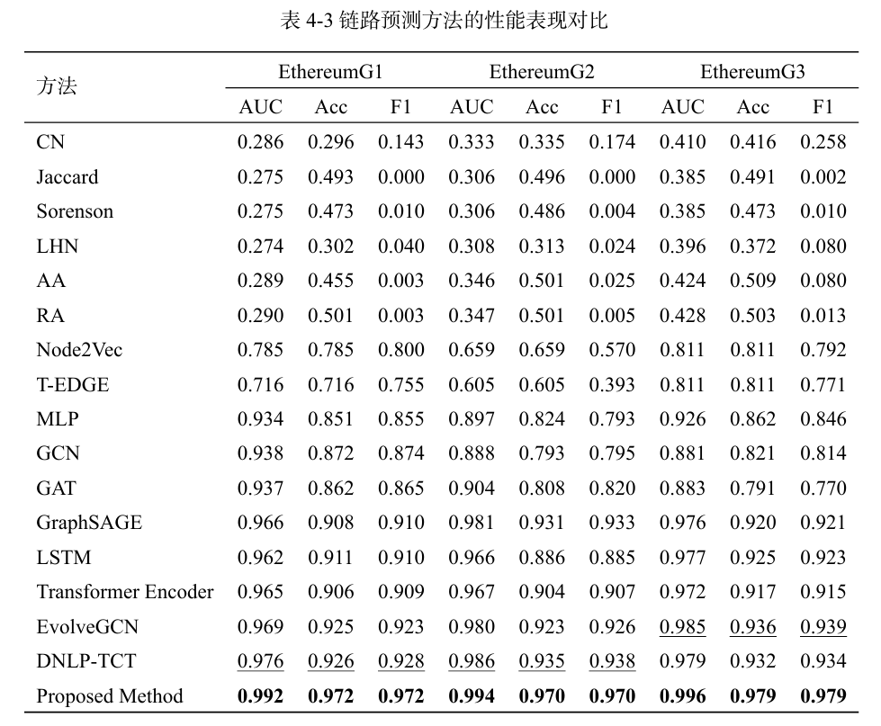

**Read this in other languages: [English](README.md), [中文](README_zh.md).**

# 🚀**Research on Blockchain Transaction Behavior Regulation Technology**

🎯 **Project Overview**  
This project aims to explore blockchain-based transaction behavior regulation technology by proposing a solution that
combines Graph Neural Networks (GNN) and anomaly detection algorithms. By analyzing and processing Ethereum transaction
data, several deep learning models are constructed to efficiently detect abnormal transaction behaviors, ensuring the
security and stability of blockchain networks.

---

## 📁 **Project Structure**

This project is modularly designed for easy expansion and maintenance, and it mainly consists of the following
directories and files:

### **📂 code_tracking_eth**

Used for tracking and modeling Ethereum transaction behavior, including the following key files:

- **`graph.py`**  
  Provides graph-related operation functions such as edge index mapping and node sampling.
- **`model.py`**  
  Implements various deep learning models, including Temporal Graph Neural Networks (**TGNN**) and Transformer models.
- **`data_load.py`**  
  Data loading and preprocessing module, supporting data reading from files and printing data information.
- **`utils.py`**  
  Contains utility functions, such as the activation function `sigmoid`.

### **📂 code_ad_eth**

For anomaly detection in Ethereum transaction behavior:

- **`preprocessing.py`**  
  Preprocessing operations for account statistics and transaction data.
- **`weight_choice.py`**  
  Provides weight selection and optimization methods.

---

## 🔍 **Key Functional Modules**

### 🛠 Data Loading and Processing

**`data_load`** function:  
Loads embedding data, train-test edge data, etc., and prints data information.

```python
def data_load(path=data_path, graph_id=3, emb_ratio=0.7):
    pklfile_emb = path + f"LPsubG{graph_id}_df_emb_{emb_ratio}.pickle"
    pklfile_train_test_edges = path + f"LPsubG{graph_id}_train_test_edges_{emb_ratio}.pickle"

    # Load data
    print("Data Loading...")
    df_emb = pd.read_pickle(pklfile_emb)
    if os.path.exists(pklfile_train_test_edges):
        with open(pklfile_train_test_edges, "rb") as f:
            train_test_edges = pickle.load(f)

    print(f"Embedding data shape: {df_emb.shape}")
    return df_emb, train_test_edges
```

### 🔗 Graph-Related Operations

**`edge_idx_map`** function：  
edge_idx_map function:
Maps edge indices based on the node dictionary.

```python
def edge_idx_map(self, nodes_dict, edges):
    return list(map(lambda x: (nodes_dict[x[0]], nodes_dict[x[1]]), list(edges)))
```

### 🤖 Model Construction

TGNN Class:
Temporal Graph Neural Network (TGNN) model for handling time-series graph data.

``` python
class TGNN(nn.Module):
    def __init__(self, in_channels, hidden_channels, temporal_steps, kernel_size):
        super(TGNN, self).__init__()
        self.conv1 = SAGEConv(in_channels, hidden_channels)
        self.conv2 = SAGEConv(hidden_channels, hidden_channels)
        self.temporal_conv = CausalConv1d(
            in_channels, in_channels, kernel_size=kernel_size)
        self.lstm = nn.LSTM(hidden_channels, hidden_channels, batch_first=True)

    def forward(self, data):
    # Temporal convolution and node feature learning
        temporal_features = torch.stack([data.x[t] for t in range(self.temporal_steps)], dim=2)
        enhanced_features = self.temporal_conv(temporal_features)
        node_features = []
        for t in range(self.temporal_steps):
            x = enhanced_features[:, :, t]
            x = torch.relu(self.conv1(x, data.edge_indexs[t]))
            x = self.conv2(x, data.edge_indexs[t])
            node_features.append(x)
        lstm_out, _ = self.lstm(torch.stack(node_features, dim=1))
        return lstm_out[:, -1, :]
```

## Environment Requirements

Please ensure the following dependencies are installed:

| **Tool/Library** | **Version** |
|------------------|-------------|
| Python           | >= 3.8      |
| PyTorch          | >= 1.10     |
| pandas           | >= 1.3      |
| numpy            | >= 1.21     |
| scikit-learn     | >= 0.24     |

Install dependencies:

```bash
pip install -r requirements.txt
```

## 📊Dataset

Dataset download
link: [Google Drive](https://drive.google.com/file/d/1VjMB8OiZ3kIU-TqF2sJ1bJVZ6BLHjUJ2/view?usp=drive_link)  
Please place the downloaded dataset in the data/ folder of the project.

## 📈Experiment Results and Analysis

In the proposed method, we compare two types of experimental results: performance comparison of anomaly detection
methods and performance comparison of link prediction methods. The experimental results are shown below:

### 1️⃣ Performance Comparison of Anomaly Detection Methods

Our method is compared with other feature learning and graph learning-based methods, with the main evaluation metrics
being Accuracy and F1-score. The results show that our method outperforms all other methods in all metrics.

Performance Comparison of Anomaly Detection Methods


**Table 1 Performance Comparison of Anomaly Detection Methods**

- **Feature Learning-Based Methods**: Including SVM and MLP, which exhibit strong performance but are inferior to graph
  learning methods.。
- **Graph Learning-Based Methods**：Including GCN, GAT, GraphSAGE, etc., which further improve performance.。
- **Proposed Method**  Achieves outstanding performance，with **Accuracy** 和 **F1-score** reaching **0.921** 和 **0.924
  **,respectively。

---

### 2️⃣ Performance Comparison of Link Prediction Methods

Our method achieves optimal performance in link prediction on various Ethereum datasets, with evaluation metrics being
AUC, Acc, and F1.。



**Table 2 Performance Comparison of Link Prediction Methods**

- **Traditional Methods**: Such as CN, Jaccard, Sorenson, etc., with lower performance.
- **Deep Learning Methods**: Such as GCN, Transformer Encoder, EvolveGCN, etc., showing good performance in AUC and F1.
- **Proposed Method**： Outperforms all other methods in AUC, Acc, and F1 across all Ethereum datasets, demonstrating
  exceptional performance.

---

### Conclusion

Through the experiments above, our method excels in both anomaly detection and link prediction tasks, proving its
effectiveness and robustness in regulating blockchain transaction behaviors.

## 📬Contact the Author

If you have any questions or collaboration intentions, please contact the author via:

- **Email**：<shimianhua@std.uestc.edu.cn>

## 📄 License

This project follows the MIT License open-source license agreement. You are free to use, copy, modify, and distribute
the code of this project, but you must include the original author information.

📜 MIT License Summary:

Free Use: No restrictions on the use of the source code.
Commercial Use: Can be used in commercial projects.
Attribution Required: The original license text must be included when distributing.
Disclaimer: The author is not responsible for any issues caused by using this project.
Click to view the full license text: LICENSE：[LICENSE](./LICENSE)

---