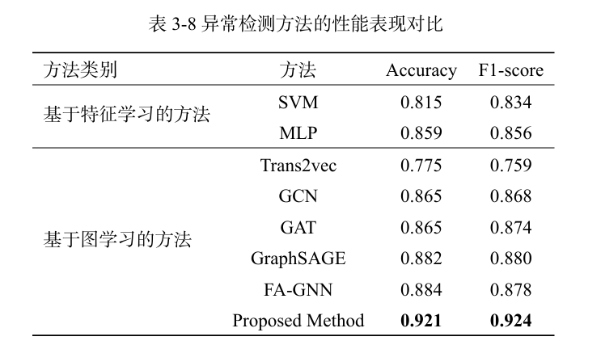
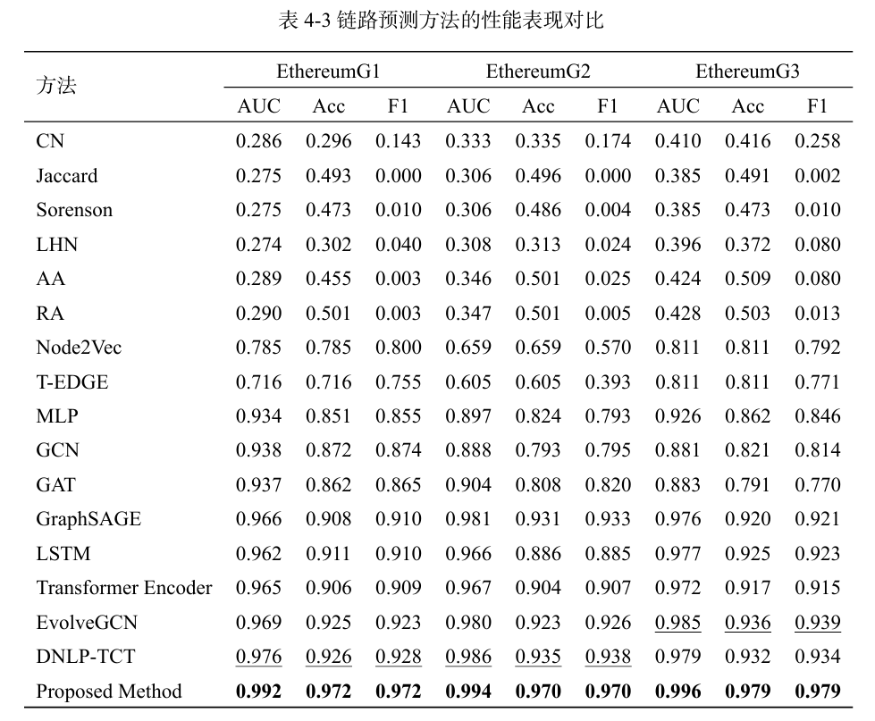

**其他语言版本: [English](README.md), [中文](README_zh.md).**

# 🚀 **区块链交易行为监管技术研究**

🎯 **项目概述**  
本项目旨在探索基于区块链的交易行为监管技术，提出了一种结合图神经网络（Graph Neural Networks,
GNN）与异常检测算法的解决方案。通过对以太坊交易数据的分析与处理，构建了多个深度学习模型，能够高效识别异常交易行为，保障区块链网络的安全性与稳定性。

---

## 📁 **项目结构**

本项目模块化设计以便于扩展和维护，主要包含以下目录与文件：

### **📂 code_tracking_eth**

用于以太坊交易行为的跟踪与建模，包含以下关键文件：

- **`graph.py`**  
  提供图相关的操作函数，例如边索引映射、节点采样等。
- **`model.py`**  
  实现了多种深度学习模型，包括时间图神经网络 (**TGNN**) 和 Transformer 模型。
- **`data_load.py`**  
  数据加载与预处理模块，支持从文件中读取数据、打印数据信息等功能。
- **`utils.py`**  
  包含常用工具函数，例如激活函数 `sigmoid` 等。

### **📂 code_ad_eth**

针对以太坊交易行为的异常检测模块：

- **`preprocessing.py`**  
  对账户统计数据与交易数据的预处理操作。
- **`weight_choice.py`**  
  提供权重选择与优化方法。

---

## 🔍 **主要功能模块**

### 🛠 数据加载与处理

**`data_load`** 函数：  
加载嵌入数据、训练测试边数据等，并打印数据信息。

```python
def data_load(path=data_path, graph_id=3, emb_ratio=0.7):
    pklfile_emb = path + f"LPsubG{graph_id}_df_emb_{emb_ratio}.pickle"
    pklfile_train_test_edges = path + f"LPsubG{graph_id}_train_test_edges_{emb_ratio}.pickle"

    # 加载数据
    print("Data Loading...")
    df_emb = pd.read_pickle(pklfile_emb)
    if os.path.exists(pklfile_train_test_edges):
        with open(pklfile_train_test_edges, "rb") as f:
            train_test_edges = pickle.load(f)

    print(f"Embedding data shape: {df_emb.shape}")
    return df_emb, train_test_edges
```

### 🔗 图相关操作

**`edge_idx_map`** 函数：  
将边的索引根据节点字典进行映射。

```python
def edge_idx_map(self, nodes_dict, edges):
    return list(map(lambda x: (nodes_dict[x[0]], nodes_dict[x[1]]), list(edges)))
```

### 🤖 模型构建

TGNN 类：
时间图神经网络模型 (Temporal Graph Neural Network)，处理时间序列图数据。

``` python
class TGNN(nn.Module):
    def __init__(self, in_channels, hidden_channels, temporal_steps, kernel_size):
        super(TGNN, self).__init__()
        self.conv1 = SAGEConv(in_channels, hidden_channels)
        self.conv2 = SAGEConv(hidden_channels, hidden_channels)
        self.temporal_conv = CausalConv1d(
            in_channels, in_channels, kernel_size=kernel_size)
        self.lstm = nn.LSTM(hidden_channels, hidden_channels, batch_first=True)

    def forward(self, data):
        # 时间卷积与节点特征学习
        temporal_features = torch.stack([data.x[t] for t in range(self.temporal_steps)], dim=2)
        enhanced_features = self.temporal_conv(temporal_features)
        node_features = []
        for t in range(self.temporal_steps):
            x = enhanced_features[:, :, t]
            x = torch.relu(self.conv1(x, data.edge_indexs[t]))
            x = self.conv2(x, data.edge_indexs[t])
            node_features.append(x)
        lstm_out, _ = self.lstm(torch.stack(node_features, dim=1))
        return lstm_out[:, -1, :]
```

## 运行环境

请确保以下依赖已安装：

| **工具/库**     | **版本**  |
|--------------|---------|
| Python       | >= 3.8  |
| PyTorch      | >= 1.10 |
| pandas       | >= 1.3  |
| numpy        | >= 1.21 |
| scikit-learn | >= 0.24 |

安装依赖

```bash
pip install -r requirements.txt
```

## 📊数据集

数据集下载地址：[Google Drive](https://drive.google.com/file/d/1VjMB8OiZ3kIU-TqF2sJ1bJVZ6BLHjUJ2/view?usp=drive_link)  
请将下载的数据集放置在项目的 `data/` 文件夹中。

## 📈实验结果与分析

在我们提出的方法中，我们对比了两类实验结果：**异常检测方法的性能对比**和**链路预测方法的性能对比**。以下是实验结果的展示：

### 1️⃣ 异常检测方法的性能对比

我们的方法与其他基于特征学习和图学习的方法进行了对比，主要评价指标为 **Accuracy** 和 **F1-score**
。结果显示，我们的方法在所有指标上均优于其他方法。



**表1 异常检测方法的性能表现对比**

- **基于特征学习的方法**：包括 SVM 和 MLP，展示了较强的性能，但不如图学习方法。
- **基于图学习的方法**：包括 GCN、GAT、GraphSAGE 等方法，性能进一步提升。
- **Proposed Method** 的表现优异，**Accuracy** 和 **F1-score** 分别达到 **0.921** 和 **0.924**。

---

### 2️⃣ 链路预测方法的性能对比

我们的方法在不同 Ethereum 数据集上的链路预测性能均取得了最优表现，评价指标为 **AUC**、**Acc** 和 **F1**。



**表2 链路预测方法性能表现对比**

- **传统方法**：如 CN、Jaccard、Sorenson 等，性能较低。
- **深度学习方法**：如 GCN、Transformer Encoder、EvolveGCN 等，在 AUC 和 F1 上表现较好。
- **Proposed Method**：在所有 Ethereum 数据集上的 **AUC**、**Acc** 和 **F1** 均优于其他方法，展示了卓越的性能。

---

### 总结

通过以上实验，我们的方法在异常检测与链路预测任务中均表现出色，证明了其在区块链交易行为监管中的有效性和鲁棒性。

## 📬联系作者

如果您有任何问题或合作意向，请通过以下方式联系作者：

- **邮箱**：<shimianhua@std.uestc.edu.cn>

## 📄 许可证

本项目遵循 **MIT License** 开源许可协议。您可以自由地使用、复制、修改和分发本项目的代码，但需注明原作者信息。

📜 **MIT License 简介**：

- **自由使用**：对项目的源代码没有使用限制。
- **商业用途**：可用于商业项目。
- **署名要求**：需要在分发时附带原始许可证文本。
- **免责条款**：对使用本项目产生的问题，作者不承担任何责任。

点击查看完整许可证文本：[LICENSE](LICENSE)

---